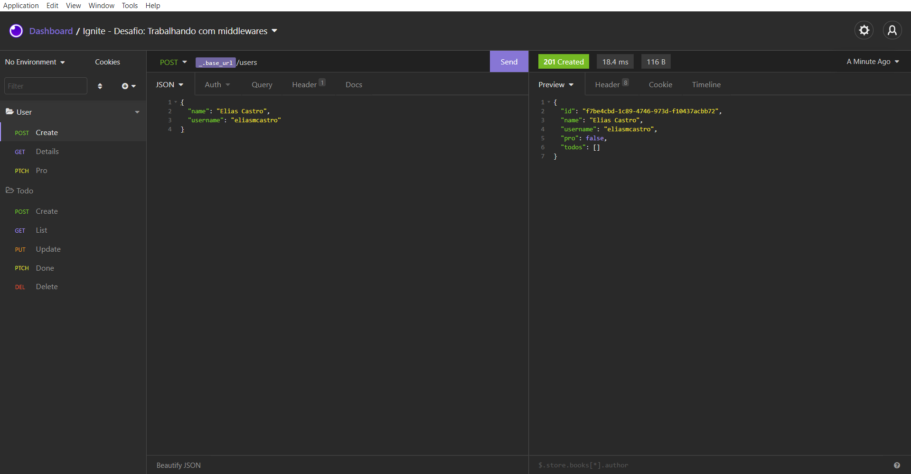

<h1 align="center">
  
</h1>

<h3 align="center">
  Desafio: Trabalhando com middlewares
</h3>

<p align="center">Criação de uma aplicação para gerenciar tarefas (todos) utilizando o Node.js e trabalhando mais a fundo com middlewares no Express</p>

<p align="center">
  <a href="#como-executar-o-projeto">Como executar o projeto</a>&nbsp;&nbsp;&nbsp;|&nbsp;&nbsp;&nbsp;
  <a href="#sobre-o-desafio">Sobre o Desafio</a>
</p>

<p align="center">Back-end</p>

<p align="center">
  
</p>

## Como executar o projeto

### Clonar este repositório

```bash
git clone https://github.com/eliasmcastro/rocketseat-ignite-nodejs-desafio-trabalhando-com-middlewares.git
```

### Requisitos

- [Node.js](https://nodejs.org)
- [Yarn](https://yarnpkg.com)

#### Opcional

- [Insomnia](https://insomnia.rest)

### Passos para a execução

**1. Executar aplicação**

Instalar as dependências do projeto

```bash
yarn
```

Iniciar o servidor de desenvolvimento

```bash
yarn dev
```

A aplicação começará a ser executada em http://localhost:3333

_Dica: utilizar o Insomnia para testar as rotas_

- Abrir o Insomnia -> Application -> Preferences -> Data -> Import Data -> From File -> Selecionar o arquivo insomnia.json

### Testes automatizados

Para começar a utilizar os testes, execute o comando `yarn test`, e ele irá te retornar o resultado dos testes

_Dica: se utilizar o comando `yarn test --watchAll`, o mesmo fica realizando automaticamente os testes toda vez que o arquivo app.js é alterado_

## Sobre o desafio

### Funcionalidades

- Criação de um usuário com `name` e `username`
- Criar um novo *todo*
- Listar todos os *todos*
- Alterar o `title` e `deadline` de um *todo* existente
- Marcar um *todo* como feito
- Excluir um *todo*

Tudo isso para cada usuário em específico (o `username` deve ser passado pelo header)

Além disso, dessa vez teremos um plano grátis onde o usuário só pode criar até dez todos e um plano Pro que irá permitir criar todos ilimitados, isso tudo usando middlewares para fazer as validações necessárias

### Middlewares da aplicação

#### checksExistsUserAccount

Esse middleware é responsável por receber o username do usuário pelo header e validar se existe ou não um usuário com o username passado. Caso exista, o usuário deve ser repassado para o request e a função next deve ser chamada.

#### checksCreateTodosUserAvailability

Esse middleware deve receber o usuário já dentro do request e chamar a função next apenas se esse usuário ainda estiver no plano grátis e ainda não possuir 10 todos cadastrados ou se ele já estiver com o plano Pro ativado.

#### checksTodoExists

Esse middleware deve receber o **username** de dentro do header e o **id** de um *todo* de dentro de `request.params`. Você deve validar o usuário, validar que o `id` seja um uuid e também validar que esse `id` pertence a um *todo* do usuário informado.

Com todas as validações passando, o *todo* encontrado deve ser passado para o `request` assim como o usuário encontrado também e a função next deve ser chamada.

#### findUserById

Esse middleware possui um funcionamento semelhante ao middleware `checksExistsUserAccount` mas a busca pelo usuário deve ser feita através do **id** de um usuário passado por parâmetro na rota. Caso o usuário tenha sido encontrado, o mesmo deve ser repassado para dentro do `request.user` e a função next deve ser chamada.

### Rotas da aplicação

#### POST `/users`

A rota deve receber `name`, e `username` dentro do corpo da requisição. Ao cadastrar um novo usuário, ele deve ser armazenado dentro de um objeto no seguinte formato:

```jsx
{ 
	id: 'uuid', // precisa ser um uuid
	name: 'Danilo Vieira', 
	username: 'danilo', 
	todos: []
}
```

Certifique-se que o ID seja um UUID, e de sempre iniciar a lista `todos` como um array vazio. O objeto do usuário deve ser retornado na resposta da requisição.

#### GET `/users/:id`

A rota deve retornar um usuário.

#### PATCH  `/users/:id/pro`

A rota deve alterar a propriedade `pro` para `true` no usuário que possuir um id igual ao id presente nos parâmetros da rota.

#### GET `/todos`

A rota deve receber, pelo header da requisição, uma propriedade `username` contendo o username do usuário e retornar uma lista com todas as tarefas desse usuário.

#### POST `/todos`

A rota deve receber `title` e `deadline` dentro do corpo da requisição e, uma propriedade `username` contendo o username do usuário dentro do header da requisição. Ao criar um novo *todo*, ele deve ser armazenada dentro da lista `todos` do usuário que está criando essa tarefa. Cada tarefa deverá estar no seguinte formato:

```jsx
{ 
	id: 'uuid', // precisa ser um uuid
	title: 'Nome da tarefa',
	done: false, 
	deadline: new Date(deadline), 
	created_at: new Date()
}
```

**Observação**: Lembre-se de iniciar a propriedade `done` sempre como `false` ao criar um *todo*.

**Dica 1**: Ao fazer a requisição com o Insomnia ou Postman, preencha a data de `deadline` com o formato `ANO-MÊS-DIA`

**Dica 2**: Usar new Date(deadline) irá realizar a transformação da string "ANO-MÊS-DIA" (por exemplo "2021-02-25") para uma data válida do JavaScript.

O objeto do todo deve ser retornado na resposta da requisição.

#### PUT `/todos/:id`

A rota deve receber, pelo header da requisição, uma propriedade `username` contendo o username do usuário e receber as propriedades `title` e `deadline` dentro do corpo. É preciso alterar **apenas** o `title` e o `deadline` da tarefa que possua o `id` igual ao `id` presente nos parâmetros da rota.

#### PATCH `/todos/:id/done`

A rota deve receber, pelo header da requisição, uma propriedade `username` contendo o username do usuário e alterar a propriedade `done` para `true` no *todo* que possuir um `id` igual ao `id` presente nos parâmetros da rota.

#### DELETE `/todos/:id`

A rota deve receber, pelo header da requisição, uma propriedade `username` contendo o username do usuário e excluir o *todo* que possuir um `id` igual ao `id` presente nos parâmetros da rota.

### Específicação dos testes

#### Testes de usuários

- **Should be able to create a new user**

Para que esse teste passe, você deve permitir que um usuário seja criado e retorne um JSON com o usuário criado.

Também é necessário que você retorne a resposta com o código `201`.

- **Should not be able to create a new user when username already exists**

Para que esse teste passe, antes de criar um usuário você deve validar se outro usuário com o mesmo `username` já existe. Caso exista, retorne uma resposta com status `400` e um json no seguinte formato:

```jsx
{
	error: 'Mensagem do erro'
}
```

#### Testes de *todos*

**Middleware**

Para completar todos os testes referentes à *todos* é necessário antes ter completado o código que falta no middleware `checkExistsUserAccount`. Para isso, você deve pegar o `username` do usuário no header da requisição, verificar se esse usuário existe e então colocar esse usuário dentro da `request` antes de chamar a função `next`. Caso o usuário não seja encontrado, você deve retornar uma resposta contendo status `404` e um json no seguinte formato:

```jsx
{
	error: 'Mensagem do erro'
}
```

- **Should be able to list all user's todos**

Para que esse teste passe, na rota GET `/todos` é necessário pegar o usuário que foi repassado para o `request` no middleware `checkExistsUserAccount` e então retornar a lista `todos` que está no objeto do usuário conforme foi criado.

- **Should be able to create a new todo**

Para que esse teste passe, na rota POST `/todos` é necessário pegar o usuário que foi repassado para o `request` no middleware `checkExistsUserAccount`, pegar também o `title` e o `deadline` do corpo da requisição e adicionar um novo *todo* na lista `todos` que está no objeto do usuário.

Após adicionar o novo *todo* na lista, é necessário retornar um status `201` e o *todo* no corpo da resposta.

- **Should be able to update a todo**

Para que esse teste passe, na rota PUT `/todos/:id` é necessário atualizar um *todo* existente, recebendo o `title` e o `deadline` pelo corpo da requisição e o `id` presente nos parâmetros da rota.

- **Should not be able to update a non existing todo**

Para que esse teste passe, você não deve permitir a atualização de um *todo* que não existe e retornar uma resposta contendo um status `404` e um json no seguinte formato:

```jsx
{
	error: 'Mensagem do erro'
}
```

- **Should be able to mark a todo as done**

Para que esse teste passe, na rota PATCH `/todos/:id/done` você deve mudar a propriedade `done`de um *todo* de `false` para `true`, recebendo o `id` presente nos parâmetros da rota.

- **Should not be able to mark a non existing todo as done**

Para que esse teste passe, você não deve permitir a mudança da propriedade `done` de um *todo* que não existe e retornar uma resposta contendo um status `404` e um json no seguinte formato: 

```jsx
{
	error: 'Mensagem do erro'
}
```

- **Should be able to delete a todo**

Para que esse teste passe, DELETE `/todos/:id` você deve permitir que um *todo* seja excluído usando o `id` passado na rota. O retorno deve ser apenas um status `204` que representa uma resposta sem conteúdo.

- **Should not be able to delete a non existing todo**

Para que esse teste passe, você não deve permitir excluir um *todo* que não exista e retornar uma resposta contendo um status `404` e um json no seguinte formato:

```jsx
{
	error: 'Mensagem do erro'
}
```

#### Testes dos middlewares

- **Should be able to find user by username in header and pass it to request.user**
    
Para que esse teste passe, você deve permitir que o middleware **checksExistsUserAccount** receba um username pelo header do request e caso um usuário com o mesmo username exista, ele deve ser colocado dentro de `request.user` e, ao final, retorne a chamada da função `next`.
    
- **Should not be able to find a non existing user by username in header**
    
Para que esse teste passe, no middleware **checksExistsUserAccount** você deve retornar uma resposta com status `404` caso o username passado pelo header da requisição não pertença a nenhum usuário.
    
- **Should be able to let user create a new todo when is in free plan and have less than ten todos**
    
Para que esse teste passe, você deve permitir que o middleware **checksCreateTodosUserAvailability** receba o objeto `user` (considere sempre que o objeto existe) da `request` e chame a função `next` somente no caso do usuário estar no **plano grátis e ainda não possuir 10 *todos* cadastrados** ou se ele **já estiver com o plano Pro ativado**.
    
Você pode verificar se o usuário possui um plano Pro ou não a partir da propriedade `user.pro`. Caso seja `true` significa que o plano Pro está em uso.
    
- **Should not be able to let user create a new todo when is not Pro and already have ten todos**
    
Para que esse teste passe, no middleware **checksCreateTodosUserAvailability** você deve retornar uma resposta com status `403` caso o usuário recebido pela requisição esteja no **plano grátis** e **já tenha 10 *todos* cadastrados**.
    
- **Should be able to let user create infinite new todos when is in Pro plan**
    
Para que esse teste passe, você deve permitir que o middleware **checksCreateTodosUserAvailability** receba o objeto `user` (considere sempre que o objeto existe) da `request` e chame a função `next` caso o usuário já esteja com o plano Pro. 
    
- **Should be able to put user and todo in request when both exits**
    
Para que esse teste passe, o middleware **checksTodoExists** deve receber o `username` de dentro do header e o `id` de um *todo* de dentro de `request.params`. Você deve validar que o usuário exista, validar que o `id` seja um uuid e também validar que esse `id` pertence a um *todo* do usuário informado.
    
Com todas as validações passando, o *todo* encontrado deve ser passado para o `request` assim como o usuário encontrado também e a função next deve ser chamada.
    
É importante que você coloque dentro de `request.user` o usuário encontrado e dentro de `request.todo` o *todo* encontrado.
    
- **Should not be able to put user and todo in request when user does not exists**
    
Para que esse teste passe, no middleware **checksTodoExists** você deve retornar uma resposta com status `404` caso não exista um usuário com o `username` passado pelo header da requisição.
    
- **Should not be able to put user and todo in request when todo id is not uuid**
    
Para que esse teste passe, no middleware **checksTodoExists** você deve retornar uma resposta com status `400` caso o `id` do *todo* passado pelos parâmetros da requisição não seja um UUID válido (por exemplo `1234abcd`).
    
- **Should not be able to put user and todo in request when todo does not exists**
    
Para que esse teste passe, no middleware **checksTodoExists** você deve retornar uma resposta com status `404` caso o `id` do *todo* passado pelos parâmetros da requisição não pertença a nenhum *todo* do usuário encontrado.
    
- **Should be able to find user by id route param and pass it to request.user**
    
Para que esse teste passe, o middleware **findUserById** deve receber o `id` de um usuário de dentro do `request.params`. Você deve validar que o usuário exista, repassar ele para `request.user` e retornar a chamada da função next.
    
- **Should not be able to pass user to request.user when it does not exists**
    
Para que esse teste passe, no middleware **findUserById** você deve retornar uma resposta com status `404` caso o `id` do usuário **passado pelos parâmetros da requisição não pertença a nenhum usuário cadastrado.